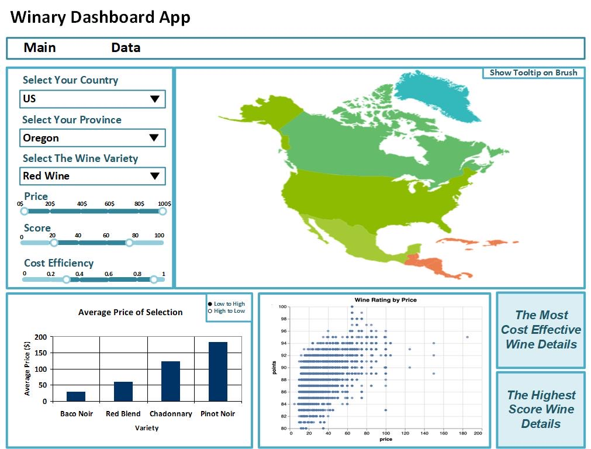

# MDS_Winery_Dashboard

The link to the deployed dashboard:
https://mds-winery-2020.herokuapp.com/

#### Team members of group 6
Jianru Deng

Mo Garoub

Kamal Moravej Jahromi

Neel Phaterpekar

## Description of the App & Sketch

This dashboard is designed to have three main graphs on the home page. Using the left-side filtering dropdown and scales, users can filter the conditions they desire by indicating one or multiple selections of country, province, wine variety, as well as the range of the review points and corresponding prices. According to the filtered conditions on the side, the choropleth map at the top highlights the relative areas as a heatmap, in which the darker-colored area has a higher volume of reviews with tooltip indicating number of reviews, average review points and prices, etc. On the bottom-left side of the page, a bar chart displays the average price given a selected wine variety. This gives a good comparison on price range and desired wine type for users to base their decision on. The last graph is a scatter plot that shows the relationship between the points and prices given the selected ranges. This  enables users to better understand if the price pays off it's value according to the given points by testers. In the bottom corner, bottle recommendations are made using the highest review points and best value (price per point), respectively.

## Reference
Thoutt, Z. (2018). Wine Reviews dataset. Retrived from: https://www.kaggle.com/zynicide/wine-reviews/data
